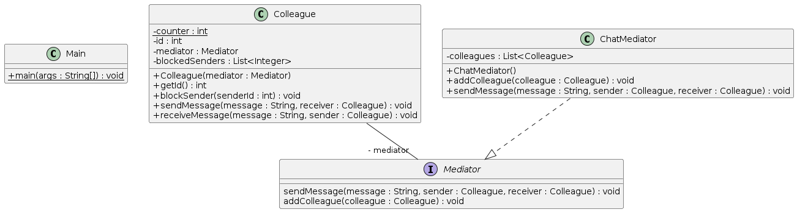

# Implementação de um chat 

## Problema

- Numa implementação de um chat os utilizadores precisam de comunicar entre si sem problemas. Se o padrão de design utilizado não for apropriado a comunicação pode tornar-se complicada de gerir á medida que a aplicação cresce. 

## Solução
- Para resolver esse problema, podemos utilizar o padrão de software Mediator. O que este padrão nos permite fazer
é centralizar a comunicação entre utilizador em um único ponto, permitindo assim que os mesmos comuniquem de forma indireta. Futuramente se o padrão for bem implementado irá facilitar possiveis manutenções da aplicação.

A solução apresentada permite:

- Enviar mensagens públicas
- Enviar mensagens privadas
- Bloquear remententes tornando impossivel a comunicação entre eles
- Receber Mensagens 

## Referências

- [DigitalOcean](https://www.digitalocean.com/community/tutorials/mediator-design-pattern-java)
- [RefactoringGuru](https://refactoring.guru/design-patterns/mediator)

## Diagrama UML

